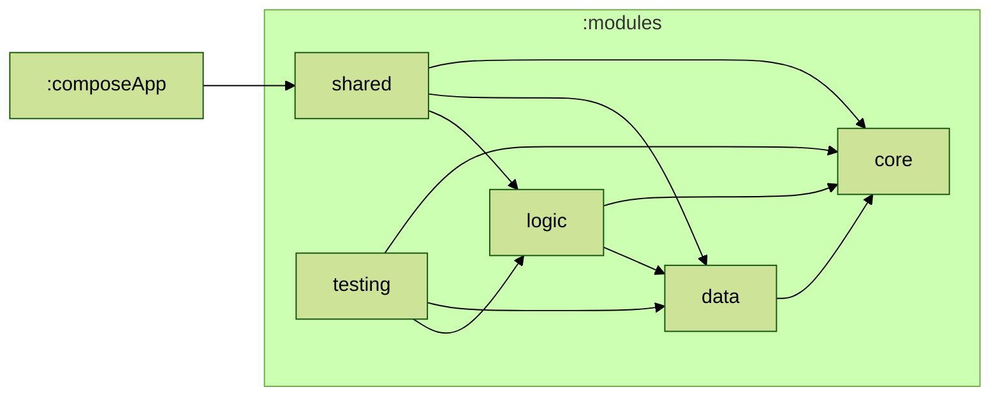

# Weather Union KMM

## Concept:
- Multiplatform mobile app that displays live weather data using [Zomato](https://www.zomato.com/)'s free [Weather Union](https://www.weatherunion.com/) API. Which also has map to show weather updates of all supported locations.

## UI:

## Tech:
- **UI** - [Compose Multiplatform](https://www.jetbrains.com/compose-multiplatform/)
- **Logic** - [Kotlin Multiplatform](https://kotlinlang.org/docs/multiplatform.html)
- **Viewmodel** - [Android ViewModel](https://www.jetbrains.com/help/kotlin-multiplatform-dev/compose-viewmodel.html)
- **DI** - [Kotlin Inject](https://github.com/evant/kotlin-inject)
- **Database** - [SQLDelight](https://sqldelight.github.io/sqldelight/2.0.2/multiplatform_sqlite/)
- **Key-Value Store** - [Proto DataStore](https://medium.com/@aribmomin111/unlocking-proto-datastore-magic-in-kmm-d397f40a0805)
- **Map** - [Google Map](https://medium.com/@aribmomin111/google-maps-in-compose-multiplatform-4db4badffb6f)
- **Logic Test** - [Kotlin Test](https://kotlinlang.org/api/latest/kotlin.test/)
- **UI Test** - [Compose Multiplatform Test](https://www.jetbrains.com/help/kotlin-multiplatform-dev/compose-test.html)

## Module Graph

