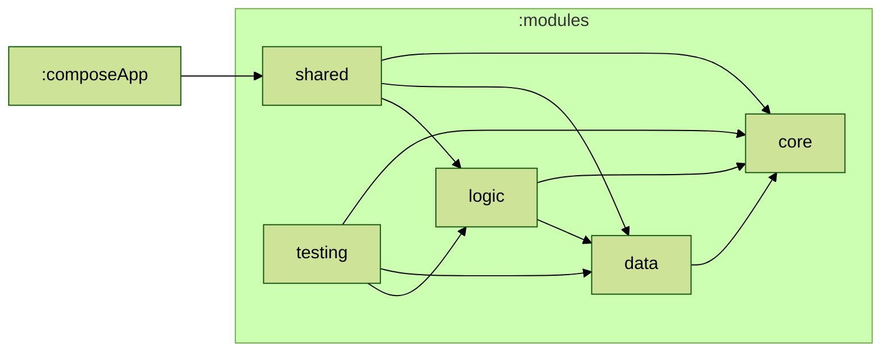

# Weather Union KMM

## Concept:
- Multiplatform mobile app that displays live weather data using [Zomato](https://www.zomato.com/)'s free [Weather Union](https://www.weatherunion.com/) API. Which also has map to show weather updates of all supported locations.

## UI:

## Tech:
- 

## Module Graph

